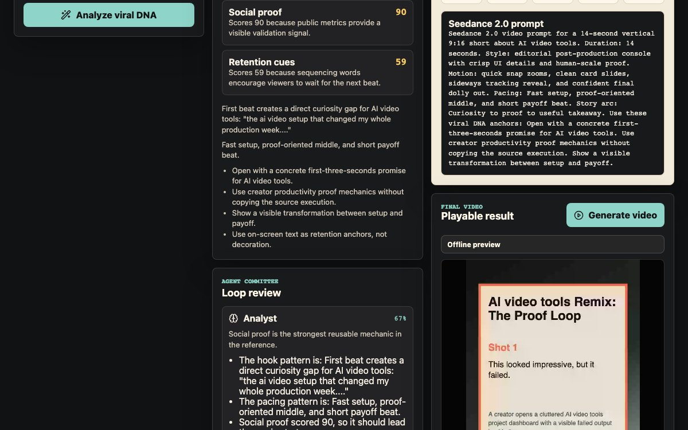

# Viral Lab

Viral Lab is a Codex Hackathon app for turning TikTok-style references into a new short-video concept and playable preview. It takes a reference URL plus transcript or scene notes, scores the viral mechanics, runs a visible agent committee, generates a five-shot remix brief, and renders a local offline WebM preview video.



## What Judges Should Look At

- Spec-first workflow: product spec and implementation plan are committed under `docs/superpowers/`.
- Viral DNA scoring: seven deterministic dimensions with rationales.
- Agent committee: Analyst, Strategist, Director, Prompt Engineer, and QA Critic.
- Remix generation: five storyboard shots, Image 2-style prompts, Seedance 2.0-style video prompt, negative prompts, captions, hashtags, and QA checklist.
- Final video path: the no-key path still produces a playable offline WebM preview from the storyboard.

## Run Locally

```bash
npm install
npm run dev
```

Open `http://127.0.0.1:5173/`.

## Verification

```bash
npm run test:run
npm run build
npm run test:e2e
```

Latest local verification before submission:

- Unit tests: 7 files, 20 tests passed.
- Production build: passed.
- Browser e2e: 2 tests passed.

## Secret Handling

`local.keys.json`, `.env.local`, build output, and test artifacts are ignored by git. The submitted repo works without provider keys by using the offline preview provider.
